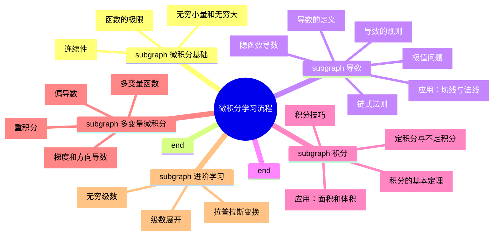

```mermaid
mindmap
  root((微积分学习流程))
    subgraph 微积分基础
      A[函数的极限]
      B[连续性]
      C[无穷小量和无穷大]
    end
    subgraph 导数
      D[导数的定义]
      E[导数的规则]
      F[链式法则]
      G[隐函数导数]
      H[应用：切线与法线]
      I[极值问题]
    end
    subgraph 积分
      J[定积分与不定积分]
      K[积分的基本定理]
      L[积分技巧]
      M[应用：面积和体积]
    subgraph 多变量微积分
      N[多变量函数]
      O[偏导数]
      P[梯度和方向导数]
      Q[重积分]
    subgraph 进阶学习
      R[无穷级数]
      S[级数展开]
      T[拉普拉斯变换]

```