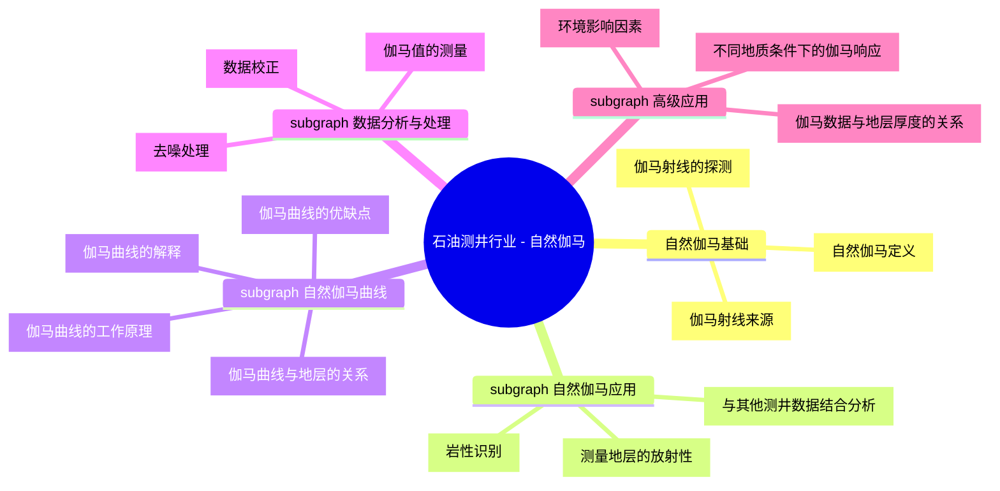

```mermaid
mindmap
  root((石油测井行业 - 自然伽马))
    自然伽马基础
      A[自然伽马定义]
      B[伽马射线来源]
      C[伽马射线的探测]
    subgraph 自然伽马应用
      D[岩性识别]
      E[测量地层的放射性]
      F[与其他测井数据结合分析]
    subgraph 自然伽马曲线
      G[伽马曲线的工作原理]
      H[伽马曲线的解释]
      I[伽马曲线与地层的关系]
      J[伽马曲线的优缺点]
    subgraph 数据分析与处理
      K[伽马值的测量]
      L[去噪处理]
      M[数据校正]
    subgraph 高级应用
      N[环境影响因素]
      O[不同地质条件下的伽马响应]
      P[伽马数据与地层厚度的关系]

```