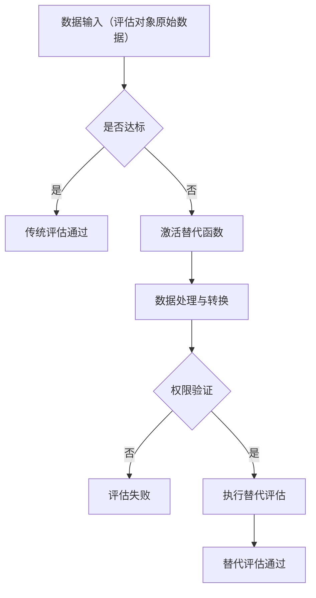

```mermaid
graph TD
    A[数据输入（评估对象原始数据）] --> B{是否达标}
    B -- 是 --> C[传统评估通过]
    B -- 否 --> D[激活替代函数]
    D --> E[数据处理与转换]
    E --> F{权限验证}
    F -- 否 --> G[评估失败]
    F -- 是 --> H[执行替代评估]
    H --> I[替代评估通过]

```