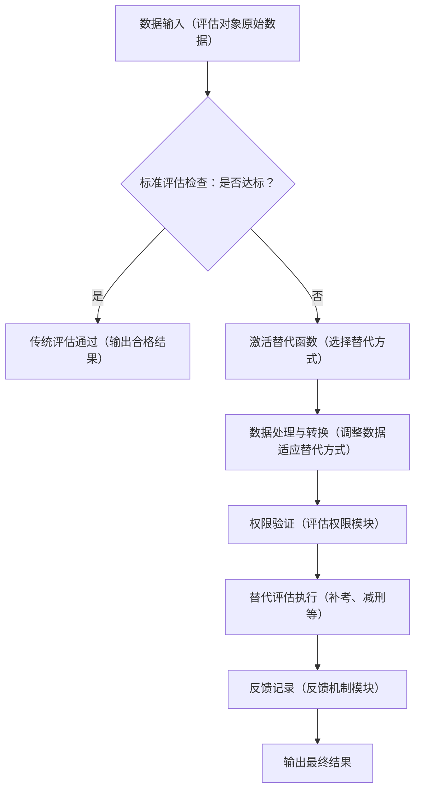

```mermaid
graph TD
    A[数据输入（评估对象原始数据）] --> B{标准评估检查：是否达标？}
    B -- 是 --> C[传统评估通过（输出合格结果）]
    B -- 否 --> D[激活替代函数（选择替代方式）]
    D --> E[数据处理与转换（调整数据适应替代方式）]
    E --> F[权限验证（评估权限模块）]
    F --> G[替代评估执行（补考、减刑等）]
    G --> H[反馈记录（反馈机制模块）]
    H --> I[输出最终结果]

```